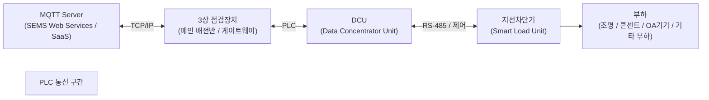
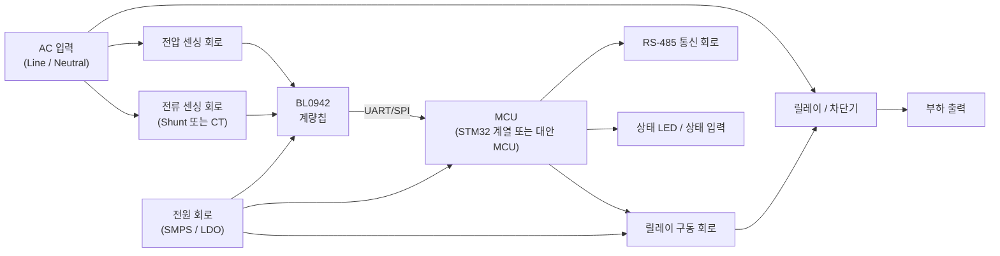
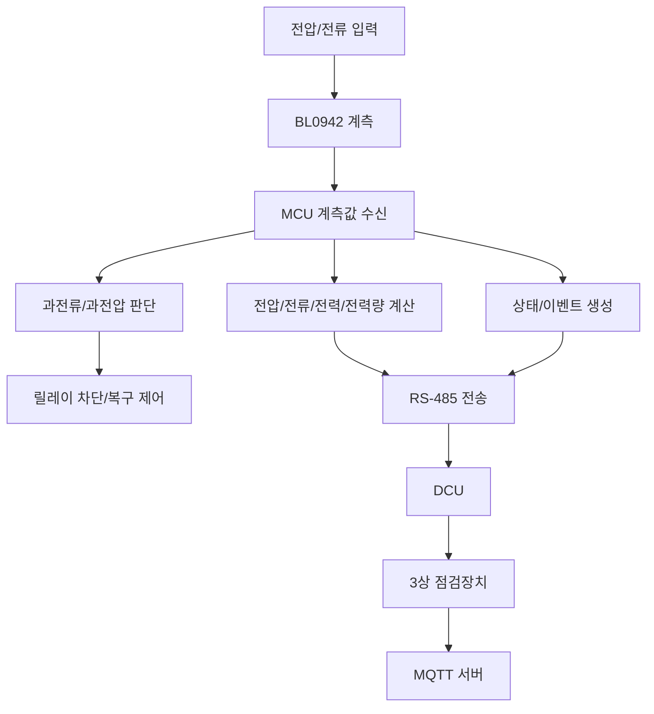
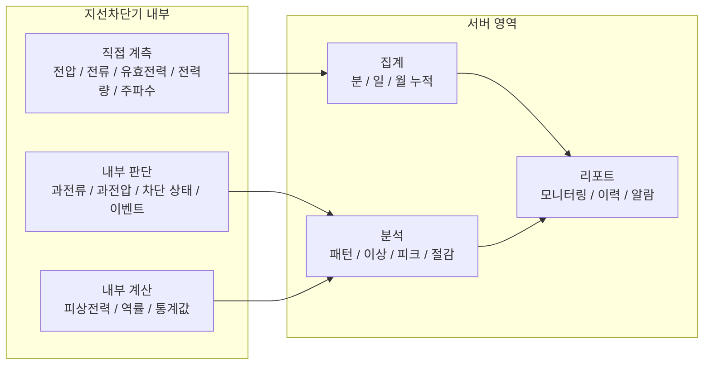
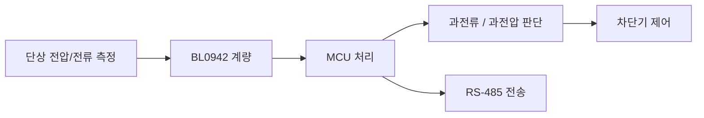

# 지선차단기 다이어그램 정리

작성일: 2026-04-06  
기준: 단상 지선차단기 / 계량칩 `BL0942` / MCU 후보 검토 중  
참고 자료:

- [지선차단기_기능정리.png](D:/work/15_지선차단기/08_참고자료/지선차단기_기능정리.png)
- [SEMS_전체전리.png](D:/work/15_지선차단기/08_참고자료/SEMS_전체전리.png)

## 1. 문서 목적

이 문서는 지선차단기의 역할과 구성, 그리고 SEMS 전체 구조 내 위치를 한눈에 보기 위한 다이어그램 정리 문서다.

현재 기준 핵심 방향은 아래와 같다.

- 1차 개발은 `단상 지선차단기` 기준
- 지선차단기는 `측정 + 자체 판단 + 차단 + 전송` 역할 수행
- `3상 점검장치`는 게이트웨이 역할
- 전체 구조는 `MQTT 서버 - 3상 점검장치 - (PLC) - DCU - 지선차단기`

## 2. 전체 시스템 구조

## 3. 지선차단기 역할

### 3.1 지선차단기 기본 역할

- 전압, 전류, 유효전력, 전력량, 주파수 측정
- 과전류/과전압 판단
- 릴레이 차단 및 상태 관리
- 계측값 및 상태 전송

### 3.2 서버 역할과 구분

- 지선차단기: 측정 + 즉시 판단 + 차단 + 전송
- 서버: 누적 + 비교 + 분석 + 절감 계산 + 리포트

## 4. 지선차단기 내부 블록도

## 5. 지선차단기 기능 흐름

## 6. 지선차단기 계측/판단/전송 구분

## 7. 지선차단기 외부 인터페이스

### 7.1 입력

- AC 전원 입력
- 전압 센싱 입력
- 전류 센싱 입력
- 설정값 또는 제어 명령

### 7.2 출력

- 릴레이 ON/OFF
- RS-485 통신 데이터
- 상태 LED
- 이벤트/알람 정보

## 8. 1차 개발 범위 다이어그램

1차 개발 포함:

- 단상 전압 측정
- 단상 전류 측정
- 유효전력
- 유효전력량
- 주파수
- 과전류/과전압 판단
- RS-485 전송

1차 개발 제외:

- 삼상
- 영상분석기
- 열화상 카메라 연동
- 고조파 분석
- 누설전류/ZCT 확장
- 아크 검출

## 9. 참고 해석

참고 이미지 기준으로 보면 구조 해석은 아래와 같다.

- `3상 점검장치`: 메인 배전반 측 게이트웨이
- `DCU`: 데이터 수집 및 중간 제어
- `지선차단기`: 현장 부하 측 단말
- `MQTT 서버`: 상위 저장/분석/서비스 영역

즉 지선차단기는 전체 SEMS의 말단 장치이며, 현장 상태를 가장 먼저 계측하고 차단을 수행하는 장치다.

## 10. 활용 방법

이 문서는 아래 용도로 사용할 수 있다.

- 소장님 보고 자료
- HW팀 회로 설명 자료
- FW 구조 설명 자료
- DCU/서버 개발자 전달 자료
- 외부 파트너 설명 자료
