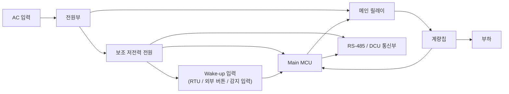

# Smart Load 보조 저전력 출력 분리 블록도

작성일: 2026-04-07

## 1. 목적

대기전력 차단 시 메인 부하는 완전히 차단하고, 감지/제어를 위한 보조 저전력 경로만 유지하는 구조를 블록도로 정리한다.

## 2. 개념

- 메인 전원 경로는 릴레이로 차단한다.
- MCU, DCU 통신, 감지 입력은 별도 보조 전원으로 계속 유지한다.
- 필요 시 특정 wake-up 입력이나 RTU 입력을 통해 메인 릴레이를 다시 ON한다.

## 3. 블록도

## 4. 동작 설명

### 4.1 정상 상태

- 메인 릴레이 ON
- 계량칩이 부하 전압/전류를 측정
- MCU는 계측값을 읽고 DCU와 통신

### 4.2 대기전력 차단 상태

- 메인 릴레이 OFF
- 부하 전원은 완전히 차단
- 보조 저전력 전원은 계속 유지
- MCU, 통신부, wake-up 입력은 계속 살아 있음

### 4.3 복구 상태

- RTU, 외부 입력, 서버 명령, 스케줄 중 하나가 들어옴
- MCU가 조건 확인 후 메인 릴레이 ON
- 계량칩 계측 재개
- 부하 전원 복구

## 5. 특징

- 메인 부하를 완전히 끊을 수 있다.
- 저항 직렬 방식보다 발열 문제가 훨씬 적다.
- MCU와 통신부는 유지되므로 원격 복구가 가능하다.
- RTU, 서버, 스케줄 복구 구조와 궁합이 좋다.

## 6. 핵심 포인트

- 보조 저전력 출력 분리는 `부하를 살짝 먹이는 구조`가 아니다.
- `감지/제어용 회로만 별도로 살리는 구조`다.
- 따라서 발열과 불확실한 부하 기동 문제를 줄일 수 있다.
